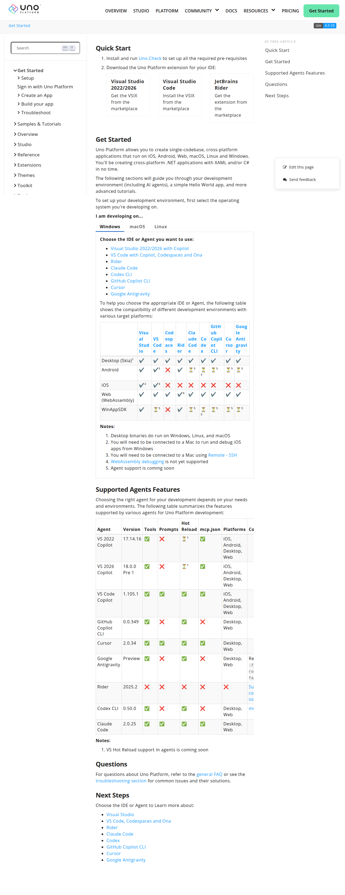

# Visited: https://aka.platform.uno/get-started
**Time:** Tue May 12 13:25:30 UTC 2026

## Screenshot

## Raw HTML
[page.html](./page.html)

## Downloaded Media (0 files)
_No media files downloaded_

## Other Links
- [#sidetoggle](#sidetoggle)
- [#tabpanel_1_linux](#tabpanel_1_linux)
- [#tabpanel_1_macos](#tabpanel_1_macos)
- [#tabpanel_1_windows](#tabpanel_1_windows)
- [#top](#top)
- [../index.html](../index.html)
- [../styles/docfx.css](../styles/docfx.css)
- [../styles/docfx.js](../styles/docfx.js)
- [../styles/docfx.vendor.js](../styles/docfx.vendor.js)
- [../styles/docfx.vendor.min.css](../styles/docfx.vendor.min.css)
- [../styles/main.css](../styles/main.css)
- [../styles/main.js](../styles/main.js)
- [common-issues-ios.html#developing-on-older-mac-hardware](common-issues-ios.html#developing-on-older-mac-hardware)
- [common-issues.html](common-issues.html)
- [faq.html](faq.html)
- [get-started-ai-claude.html](get-started-ai-claude.html)
- [get-started-ai-codex.html](get-started-ai-codex.html)
- [get-started-ai-cursor.html](get-started-ai-cursor.html)
- [get-started-ai-gh-copilot-cli.html](get-started-ai-gh-copilot-cli.html)
- [get-started-ai-google-antigravity.html](get-started-ai-google-antigravity.html)
- [get-started-rider.html](get-started-rider.html)
- [get-started-vs-2022.html](get-started-vs-2022.html)
- [get-started-vscode.html](get-started-vscode.html)
- [https://aka.platform.uno/rider-extension-marketplace](https://aka.platform.uno/rider-extension-marketplace)
- [https://aka.platform.uno/uno-check#install-and-run-uno-check](https://aka.platform.uno/uno-check#install-and-run-uno-check)
- [https://aka.platform.uno/vs-extension-marketplace](https://aka.platform.uno/vs-extension-marketplace)
- [https://aka.platform.uno/vscode-extension-marketplace](https://aka.platform.uno/vscode-extension-marketplace)
- [https://cdn.jsdelivr.net/npm/@docsearch/css@3](https://cdn.jsdelivr.net/npm/@docsearch/css@3)
- [https://cdn.jsdelivr.net/npm/@docsearch/js@3](https://cdn.jsdelivr.net/npm/@docsearch/js@3)
- [https://cdnjs.cloudflare.com/ajax/libs/highlight.js/11.0.1/highlight.min.js](https://cdnjs.cloudflare.com/ajax/libs/highlight.js/11.0.1/highlight.min.js)
- [https://github.com/openai/codex/issues/2628](https://github.com/openai/codex/issues/2628)
- [https://github.com/unoplatform/uno/blob/master/doc/articles/get-started.md/#L1](https://github.com/unoplatform/uno/blob/master/doc/articles/get-started.md/#L1)
- [https://marketplace.visualstudio.com/items?itemName=ms-vscode-remote.remote-ssh](https://marketplace.visualstudio.com/items?itemName=ms-vscode-remote.remote-ssh)
- [https://unpkg.com/highlightjs-dotnetconfig@0.9.3/dist/dotnetconfig.min.js](https://unpkg.com/highlightjs-dotnetconfig@0.9.3/dist/dotnetconfig.min.js)
- [https://unpkg.com/mermaid@8.14.0/dist/mermaid.min.js](https://unpkg.com/mermaid@8.14.0/dist/mermaid.min.js)
- [https://www.googletagmanager.com/ns.html?id=GTM-WKG4KZV](https://www.googletagmanager.com/ns.html?id=GTM-WKG4KZV)
- [https://youtrack.jetbrains.com/issue/JUNIE-461/MCP-Remote-Server-Support](https://youtrack.jetbrains.com/issue/JUNIE-461/MCP-Remote-Server-Support)
- [https://youtrack.jetbrains.com/issue/RIDER-103346/Uno-Platform-for-WebAssembly-debugger-support](https://youtrack.jetbrains.com/issue/RIDER-103346/Uno-Platform-for-WebAssembly-debugger-support)

## Stats
- Links: 40
- Media: 0
