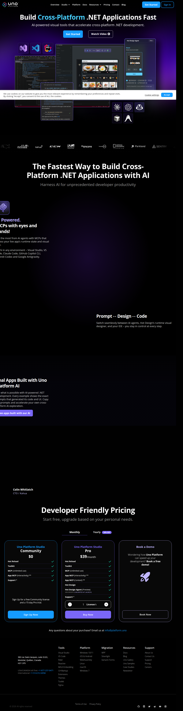

# Visited: https://platform.uno/
**Time:** Tue May 12 13:30:12 UTC 2026

## Screenshot

## Raw HTML
[page.html](./page.html)

## Downloaded Media (40 files)
## Downloaded Media Files

## Other Links
- [#](#)
- [#content](#content)
- [#path-1](#path-1)
- [#path-3](#path-3)
- [#path-5](#path-5)
- [#path-7](#path-7)
- [/](/)
- [//static.ads-twitter.com/oct.js](//static.ads-twitter.com/oct.js)
- [//t.co/i/adsct?txn_id=o8000&p_id=Twitter&tw_sale_amount=0&tw_order_quantity=0](//t.co/i/adsct?txn_id=o8000&p_id=Twitter&tw_sale_amount=0&tw_order_quantity=0)
- [/my-account](/my-account)
- [/rider](/rider)
- [/studio](/studio)
- [https://aka.platform.uno/chefs-sampleapp](https://aka.platform.uno/chefs-sampleapp)
- [https://aka.platform.uno/get-started](https://aka.platform.uno/get-started)
- [https://aka.platform.uno/hot-design-agent](https://aka.platform.uno/hot-design-agent)
- [https://aka.platform.uno/mcp](https://aka.platform.uno/mcp)
- [https://aka.platform.uno/tech-bites](https://aka.platform.uno/tech-bites)
- [https://analytics.twitter.com/i/adsct?txn_id=o8000&p_id=Twitter&tw_sale_amount=0&tw_order_quantity=0](https://analytics.twitter.com/i/adsct?txn_id=o8000&p_id=Twitter&tw_sale_amount=0&tw_order_quantity=0)
- [https://discord.gg/XjsmQHdKfq](https://discord.gg/XjsmQHdKfq)
- [https://fonts.googleapis.com](https://fonts.googleapis.com)
- [https://fonts.googleapis.com/css2?family=Open+Sans:ital,wght@0,300..800;1,300..800&display=swap](https://fonts.googleapis.com/css2?family=Open+Sans:ital,wght@0,300..800;1,300..800&display=swap)
- [https://fonts.gstatic.com](https://fonts.gstatic.com)
- [https://gallery.platform.uno/](https://gallery.platform.uno/)
- [https://github.com/unoplatform](https://github.com/unoplatform)
- [https://github.com/unoplatform/uno](https://github.com/unoplatform/uno)
- [https://gmpg.org/xfn/11](https://gmpg.org/xfn/11)
- [https://new.platform.uno/](https://new.platform.uno/)
- [https://platform.uno/](https://platform.uno/)
- [https://platform.uno/about-us/](https://platform.uno/about-us/)
- [https://platform.uno/app/plugins/cookie-law-info/legacy/public/js/cookie-law-info-public.js?ver=3.4.0](https://platform.uno/app/plugins/cookie-law-info/legacy/public/js/cookie-law-info-public.js?ver=3.4.0)
- [https://platform.uno/app/plugins/elementor-pro/assets/js/elements-handlers.min.js?ver=3.35.1](https://platform.uno/app/plugins/elementor-pro/assets/js/elements-handlers.min.js?ver=3.35.1)
- [https://platform.uno/app/plugins/elementor-pro/assets/js/frontend.min.js?ver=3.35.1](https://platform.uno/app/plugins/elementor-pro/assets/js/frontend.min.js?ver=3.35.1)
- [https://platform.uno/app/plugins/elementor-pro/assets/js/webpack-pro.runtime.min.js?ver=3.35.1](https://platform.uno/app/plugins/elementor-pro/assets/js/webpack-pro.runtime.min.js?ver=3.35.1)
- [https://platform.uno/app/plugins/elementor-pro/assets/lib/smartmenus/jquery.smartmenus.min.js?ver=1.2.1](https://platform.uno/app/plugins/elementor-pro/assets/lib/smartmenus/jquery.smartmenus.min.js?ver=1.2.1)
- [https://platform.uno/app/plugins/elementor-pro/assets/lib/sticky/jquery.sticky.min.js?ver=3.35.1](https://platform.uno/app/plugins/elementor-pro/assets/lib/sticky/jquery.sticky.min.js?ver=3.35.1)
- [https://platform.uno/app/plugins/elementor/assets/js/frontend-modules.min.js?ver=3.35.5](https://platform.uno/app/plugins/elementor/assets/js/frontend-modules.min.js?ver=3.35.5)
- [https://platform.uno/app/plugins/elementor/assets/js/frontend.min.js?ver=3.35.5](https://platform.uno/app/plugins/elementor/assets/js/frontend.min.js?ver=3.35.5)
- [https://platform.uno/app/plugins/elementor/assets/js/webpack.runtime.min.js?ver=3.35.5](https://platform.uno/app/plugins/elementor/assets/js/webpack.runtime.min.js?ver=3.35.5)
- [https://platform.uno/app/plugins/premium-addons-for-elementor/assets/frontend/min-js/elements-handler.min.js?ver=4.11.69](https://platform.uno/app/plugins/premium-addons-for-elementor/assets/frontend/min-js/elements-handler.min.js?ver=4.11.69)
- [https://platform.uno/app/plugins/woocommerce/assets/js/frontend/order-attribution.min.js?ver=10.5.2](https://platform.uno/app/plugins/woocommerce/assets/js/frontend/order-attribution.min.js?ver=10.5.2)
- [https://platform.uno/app/plugins/woocommerce/assets/js/sourcebuster/sourcebuster.min.js?ver=10.5.2](https://platform.uno/app/plugins/woocommerce/assets/js/sourcebuster/sourcebuster.min.js?ver=10.5.2)
- [https://platform.uno/app/themes/hello-elementor-child/assets/img/favicon/site.webmanifest](https://platform.uno/app/themes/hello-elementor-child/assets/img/favicon/site.webmanifest)
- [https://platform.uno/app/themes/hello-elementor-child/assets/js/scripts.js?ver=1776965001](https://platform.uno/app/themes/hello-elementor-child/assets/js/scripts.js?ver=1776965001)
- [https://platform.uno/app/themes/hello-elementor-child/dist/js/timeline.js](https://platform.uno/app/themes/hello-elementor-child/dist/js/timeline.js)
- [https://platform.uno/app/themes/hello-elementor/assets/js/hello-frontend.js?ver=3.4.6](https://platform.uno/app/themes/hello-elementor/assets/js/hello-frontend.js?ver=3.4.6)
- [https://platform.uno/blog/](https://platform.uno/blog/)
- [https://platform.uno/c-markup/](https://platform.uno/c-markup/)
- [https://platform.uno/careers/](https://platform.uno/careers/)
- [https://platform.uno/case-studies/](https://platform.uno/case-studies/)
- [https://platform.uno/code-samples/](https://platform.uno/code-samples/)

## Stats
- Links: 151
- Media: 40
